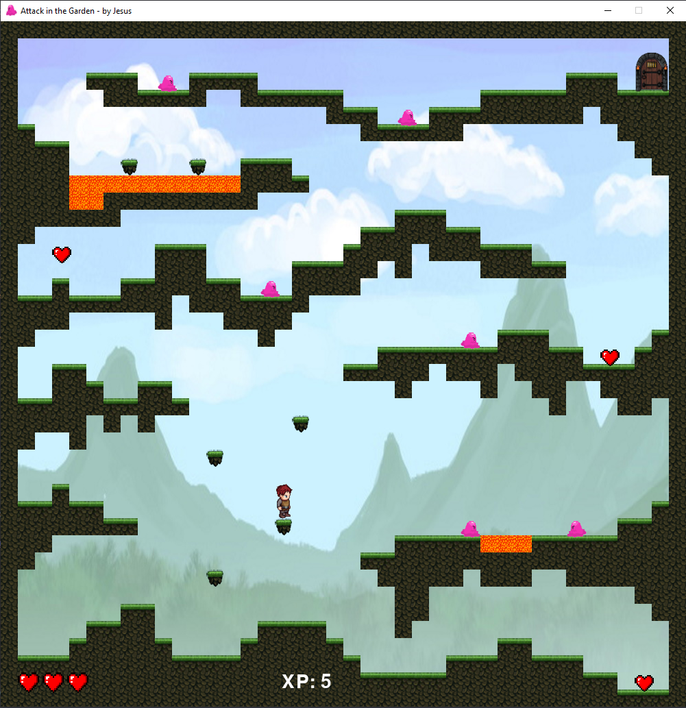

# Platformer - Attack in the Garden

> A platformer game named "Attack in the Garden" that I'm developing with Pygame.

---

## Description

This is a platform game that I developed in Python. The player moves with the LEFT and RIGHT keys and jumps with the SPACE key.
There are enemies that will cause damage if the player collides with them from the sides, but he can kill them by stepping on them.
The player starts with 3 hearts, but can win more over the level. The goal is to reach the door in the upper right corner of the screen.
---

## Author Info

- Twitter - [@andre_j3sus](https://twitter.com/andre_j3sus)
- Website - [André Jesus](https://sites.google.com/view/andre-jesus/p%C3%A1gina-inicial)

[Back To The Top](#platformer---attack-in-the-garden)